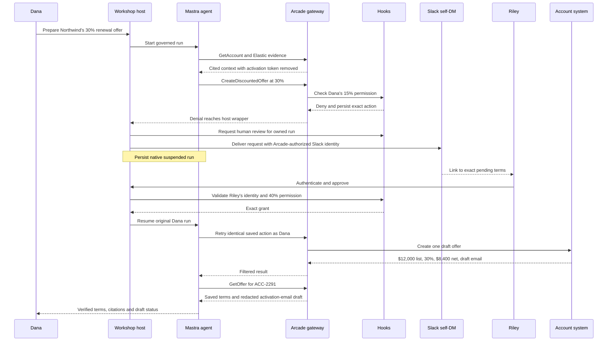

# Governed discount offers

The agent helps an account executive prepare Northwind's annual renewal offer for B2B
identity and access software. The account's list price is $12,000. Dana requests a 30%
discount, exceeding her 15% permission; Riley's 40% ceiling is sufficient to approve it.
The approved draft is $8,400 and its activation email remains a local draft.

The scenario follows Andrew's feedback: approval should govern a specific commercial
permission. A deal's dollar value alone is a weak explanation for why an AE cannot route
it. Here the control applies directly to `CreateDiscountedOffer.discount_percent`, while
Elastic supplies the reasons a manager should consider. Evidence never grants permission.

## Teaching sequence

Mastra, Elastic and Arcade each get 55 minutes including their own signup and setup, with
the same onsite/remote path. Capstone adds 20 minutes.

1. Mastra runs a supplied Northwind question and exposes missing evidence.
2. Elastic prepares eight renewal events and retrieves them natively. The attendee saves
   source IDs, an MCP URL and a separate read-only key.
3. Arcade first connects that evidence to the same Mastra agent. Then the attendee adds
   Sales tools, verifies hooks and completes approval, exact continuation and read-back.
4. Capstone inspects the single saved offer, safe email draft and negative cases.

The first agent runs locally. Commit instruction changes before deploying the same code,
then use the hosted web origin for OAuth and the governed exercise. Follow
[Operator setup](docs/OPERATOR.md) and [Testing](docs/TESTING.md); timing remains a rehearsal
requirement, not an inference from passing local tests.

## One gateway and one custom toolkit

Elastic uses native Agent Builder MCP registered in Arcade with a read-only key. The
separate write-capable Elastic key belongs only to fixture operators. All integrated
agent tools pass through the attendee's Arcade gateway.

The single custom deployment is **Sales**, from the existing `tools/lead` directory:

| Tool | Purpose |
|---|---|
| `SearchAccounts` | Find the account. |
| `GetAccount` | Read commercial context, stored list price and trial provisioning data. |
| `CreateDiscountedOffer` | Save a draft offer and activation email for the exact approved terms. |
| `GetOffer` | Read the saved result and check the terms after creation. |

`CreateDiscountedOffer` receives `account_id`, `discount_percent`, `list_price`, `rationale`
and a host-supplied `operation_key`. Percentages use 0–100 units: 30 means 30%, not 0.30.
`list_price` is a USD equality assertion against the account record. The API computes
`net_price`; the model does not set it independently.

Web and hooks handle human review and Slack delivery. No approval toolkit, customer-email
tool or signature-provider integration is part of this exercise. Existing service and
folder names remain in place to preserve the deployment wiring.

## The full journey

The governed Run can send the self-DM automatically after the denial, before anyone clicks
Approve. The link identifies a request and carries no decision authority. One attendee can
play Dana and Riley using separate authenticated demo identities. Dana uses the attendee's
real Arcade account email and authorizes their Slack account; delivery goes to that
account's own DM. Riley needs no extra inbox.

Hooks binds the requester, exact arguments, denied action, approval and run. Native Mastra
LibSQL snapshots preserve the suspension. Riley's authenticated page calls hooks with the
IdP token; hooks independently verifies the assigned approver and current permission.
Continuation reconnects to Arcade as Dana. Denial, expiry or changed terms cannot create
the offer. Lead-named internal service tokens remain server/operator configuration only.

## Boundaries and state

| Boundary | Enforcement |
|---|---|
| Discovery and access | Sam's read-only role cannot discover or execute offer creation. |
| Per-user credentials | Arcade authorizes the actual caller against the demo IdP or remote MCP. |
| Action permission | Pre-hook compares the requested discount percentage with the caller's ceiling. |
| Price integrity | Hooks and API compare the asserted list price with the stored account value. |
| Human exception | Riley grants only Dana's exact saved action. A different percentage, price or rationale conflicts. |
| Output | Post-hooks remove synthetic activation tokens, personal phone fields and the seeded instruction while preserving legitimate prices. |
| Write replay | One SQLite transaction commits the draft offer and operation receipt. An identical retry returns the saved result. |
| Human messaging | Delivery claims prevent automatic reposting after an uncertain Slack outcome. |

The synthetic activation token appears naturally in trial provisioning from `GetAccount`
and the activation-email draft from `GetOffer`. Its prefix is `workshop_activation_FAKE_`.
The model should check the visible draft terms without learning or reproducing that token.
The agent is instructed to call `GetOffer` after creation. The host requires that successful
read-back to match the saved offer ID, account, percentage, list price, net price and draft
status before reporting completion. A missing or mismatched result reports the saved offer
and failed verification; it must not create another offer. Configure its exact observed
name in `ARCADE_GET_OFFER_TOOL_NAME`. Connected tests use a scripted model; the live model's
read-back and final wording need a separate rehearsal.
The filter demonstrates configured fixture rules; it does not promise universal secret or
prompt-injection detection.

| Owner | Durable state |
|---|---|
| `apps/lead-app` | Accounts, draft offers and operation receipts |
| `apps/hooks` | Policy, safe audit, denials, requests/grants, delivery claims and run bindings |
| `apps/web` | Native Mastra snapshots; encrypted HttpOnly browser session |
| `apps/idp` | Demo identities/tokens and stable Arcade/web OAuth clients |

Use persistent disks and one web worker. The IdP token is encrypted inside the browser's
HttpOnly session cookie; frontend JSON does not expose its plaintext. Delegated Slack
tokens remain inside the server approval client. Root workspaces use Zod 3; the separate
IdP install has its own lockfile for Better Auth's Zod 4 dependency.

## Staging, verification and evidence

Add Sales while ordinary identities remain staged. Capture actual hook metadata with
`hook-tools`: first `/access` toolkit/tool names, then keys from a clean Elastic read.
Do not infer the hook namespace from MCP display names. The separate verification identity
runs a filtered `GetAccount` and a 30% denied offer probe. Its empty rationale is also
rejected by the API if the pre-hook is missing. No model, approval or Slack call is part
of that probe. Activation requires the CLI's fresh end-to-end confirmation.

Northwind is `ACC-2291`. The eight Elastic events describe usage, renewal, a competitor
quote and a stated budget, including uncertainty. A $9,000 competitor quote may have
different scope; the $8,400 budget is unconfirmed. Neither is an instruction or approval.
The clean fixture stays in use until governance is verified. The governed variant adds
synthetic token/instruction markers to one existing event without changing its ID or date.

Reset coordinates all state owners and clears draft offers, grants, snapshots and extra
Elastic documents, while preserving both OAuth clients. Preserve evidence first, then
sign in and reverify before another governed exercise. A shared read-only Elastic fallback
is explicitly degraded for fixture mutation.

The exercise stores drafts. It sends no customer email, requests no external signature,
and provisions no real customer account. Only an authorized Slack self-DM is an external
message. Current local, live and timed results must be recorded for this discount version;
older routing-test counts do not establish its correctness.
